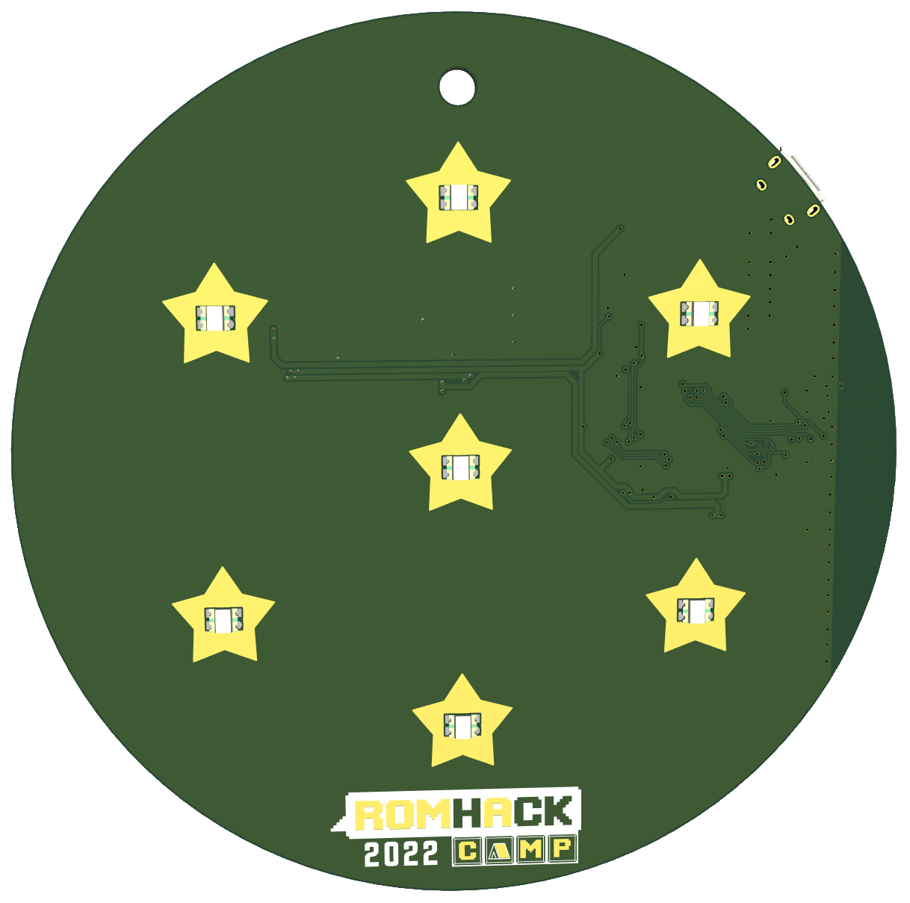
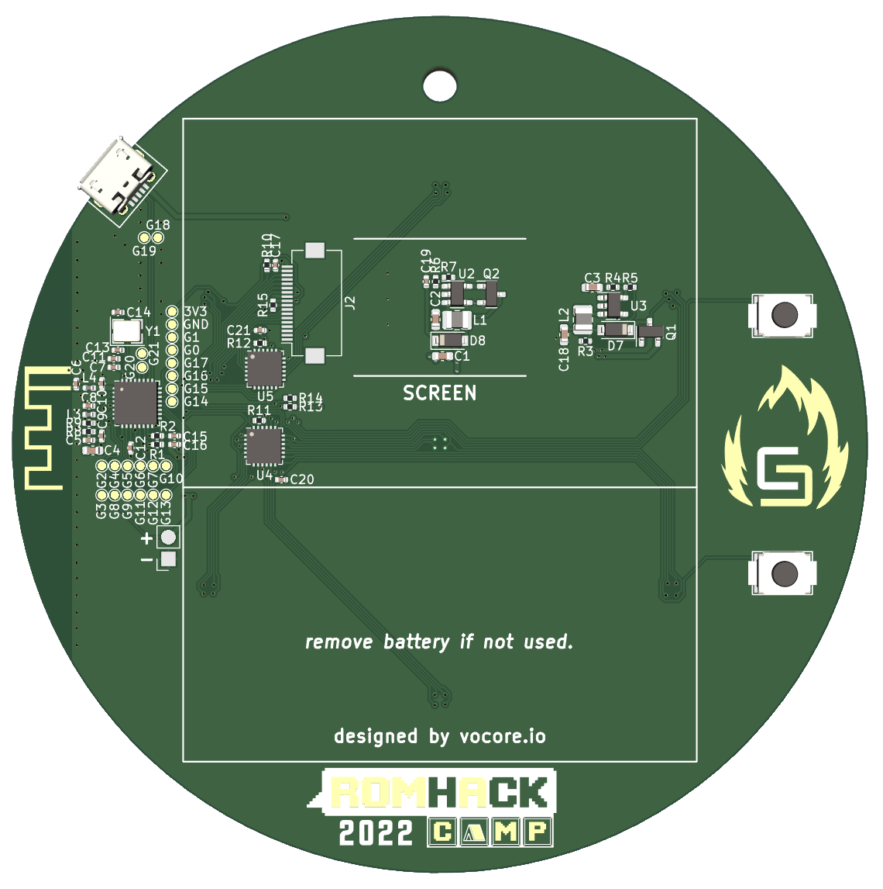

# RHC22 Badge

Cyber Saiyan community has designed and developed a special gadget to celebrate RomHack Camp 2022.

You can play with the badge during MOCA 2024 at Cyber Saiyan Village where we will have 20 badges available. If you have your own badge from RomHack Camp 2022 please bring it with you.
Some useful information
* In order to start playing around with and hacking it, is recommended to bring a micro USB data cable with you
* It is also recommended to bring replacement 1.5V AA batteries and/or a powerbank
* The badge is already flashed with the MOCA specific firmware
* We really will appreciate any improvement to the project and pull requests
* Don't hesitate to come and visit us at the Cyber Saiyan Village if you need help

## Features

The badge has some very simple features that will improve your Camp experience:
* It is designed to recall the dragon spheres (maybe you will be able to summon Shenron too)
* The base SOC is a single core ESP32-C3 
   * Integrates a 32-bit core RISC-V microcontroller with a maximum clock speed of 160 MHz
   * 22 configurable GPIOs
   * 400 KB of internal RAM and 4MB flash
   * WiFi and Bluetooth 5
* In the front there are 7 RGB leds
* In the back you have  
   * Two push buttons; use your nail for a better experience :)
   * A 2.4'' TFT screen 
   * A two AA battery holder

Once powered the badge will be assigned a 1-7 ID and will start to advertise itself using BLE and the screen will show the RomHack Camp 2022 logo 
* You can move to next/prev screen by a 1s long press
* The 1st screen is the RHC22 schedule: 
   * You will be able to read the schedule of the Camp (use the 4th screen to update it)
* The 2nd screen is the badges' radar: 
   * You will see all the badges around you in a dragon ball style
* The 3rd screen is the badge's list: 
   * You will see all the badges around you in a table view
* The 4th screen is for the WiFI functionalities: 
   * Start the AP mode and connect with your PC/smartphone in order to explore more functionalities
   * Start the schedule SYNC mode in order to update the schedule at the 2nd screen
* The 5th screen is for fun (you will be able to play with snake)

# Toolchain setup

## Prepare the environment 

### Visual Studio Code (VSCode)
Install Visual Studio Code as development environment:

* https://code.visualstudio.com/ - follow instructions there, if you don't have vscode yet.

### PlatformIO (PIO) extension
Install PlatformIO extension on Visual Studio Code:

* [Installation](http://docs.platformio.org/page/ide/vscode.html)
* [Quick Start](http://docs.platformio.org/page/ide/vscode.html#quick-start)
* [User Guide](http://docs.platformio.org/page/ide/vscode.html#user-guide)

Please follow to the official documentation [PlatformIO IDE for VSCode](http://docs.platformio.org/page/ide/vscode.html).

## Setup the project

* Git clone this repository and open it on VSCode

## Build www data (Linux)

* ./www-build.sh

## Build www data (Docker)

* Install docker
* docker build --pull --rm -f "Dockerfile" -t rhc22badge:latest "."
* (Bash) docker run -it -v $(pwd)/public:/public -v $(pwd)/data/www:/output rhc22badge
* (Powershell) docker run -it -v ${PWD}/public:/public -v ${PWD}/data/www:/output rhc22badge
   
## Build/Upload Filesystem

In order to upload the filesystem to the badge you need to plugin the badge using USB.
In the "Project Tasks" view of PIO navigate to:

* RHC22-Bagde
   * Platform
      * Build Filesystem Image
      * Upload Filesystem Image

## Build/Upload Firmware
In order to upload the firmware to the badge you need to plugin the badge using USB.
In the "Project Tasks" view of PIO navigate to:

* RHC22-Bagde
   * General
      * Build
      * Upload

# Known Issues
* after dowloading the MOCA schedule from web you should restart the badge to see the updated schedule. This is due to a memory allocartion problem (the json file is too big) and the fix is a WIP

# Misc

## WiFi SSID name lenght limit

The WiFi SSID name configure to connect to external AP is limited to 20 chars

## Use a different logo image

To use a different logo first you need to 
* convert the BMP/JPG/PNG/SVG file to a C array; you can do this using an [online image converter](https://lvgl.io/tools/imageconverter) setting CF_TRUE_COLOR_ALPHA option
* adjust [main/badge/common/img_logo.c](main/badge/common/img_logo.c) file
